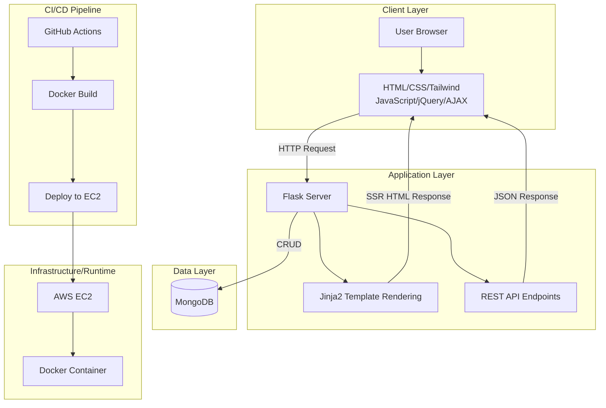
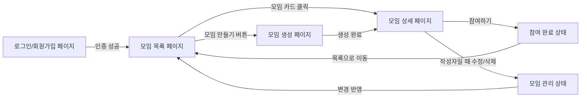
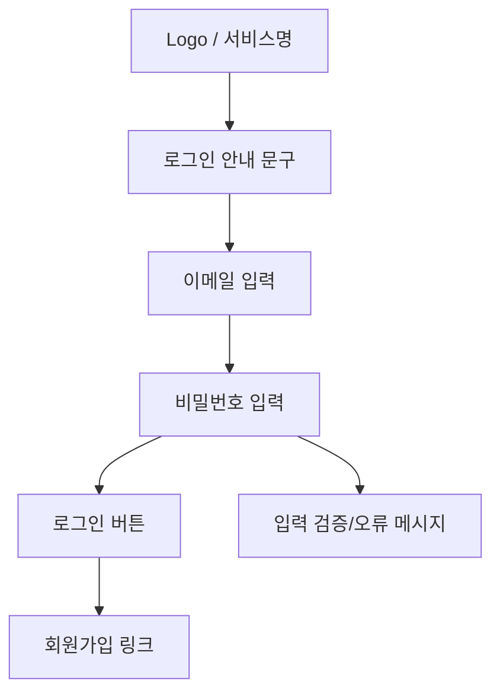
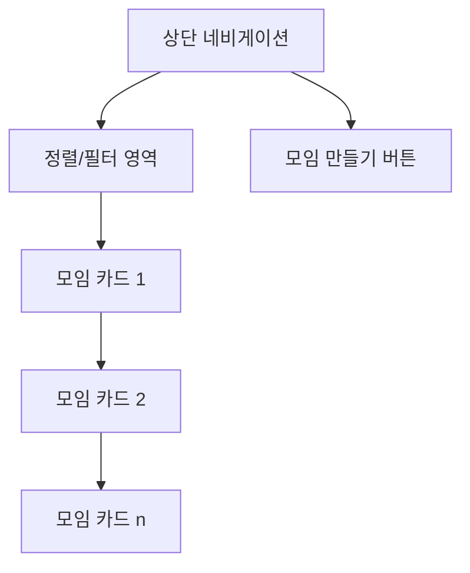
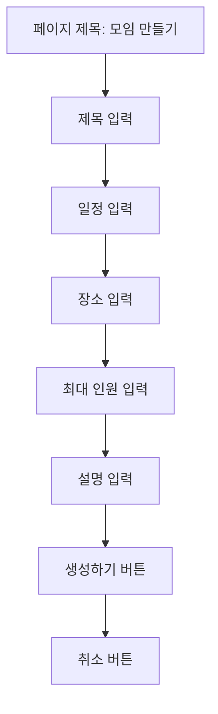
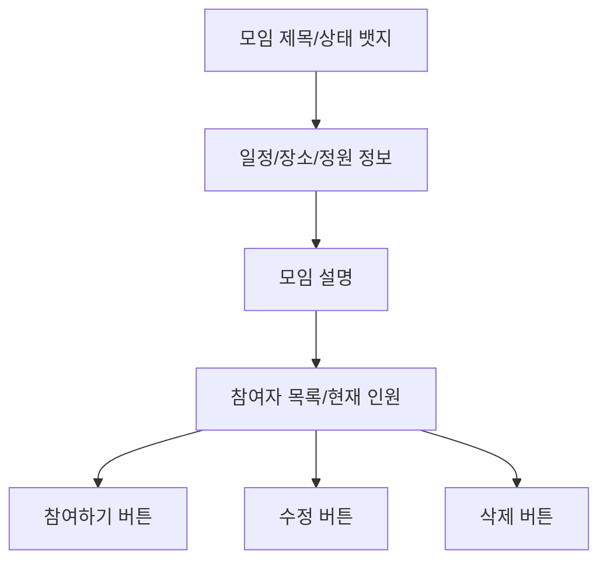
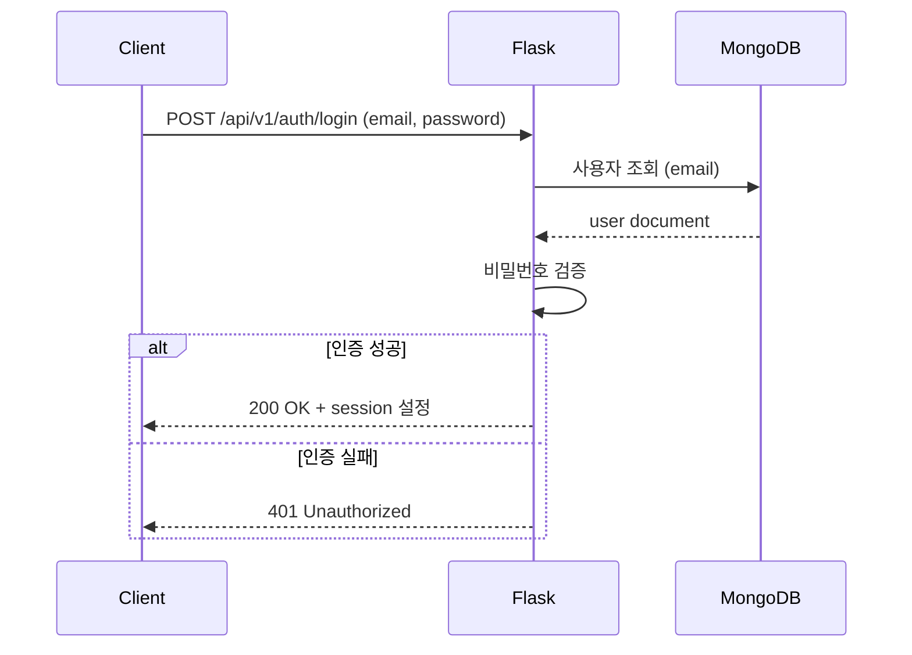
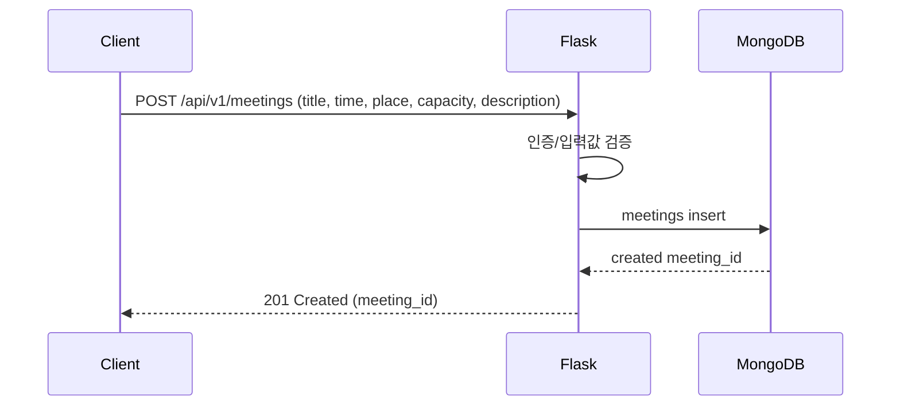
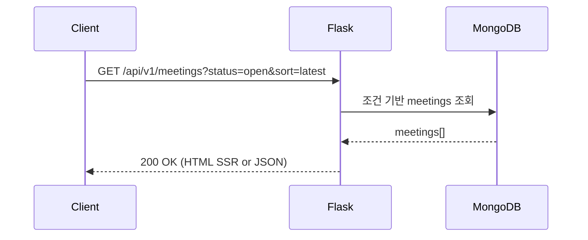
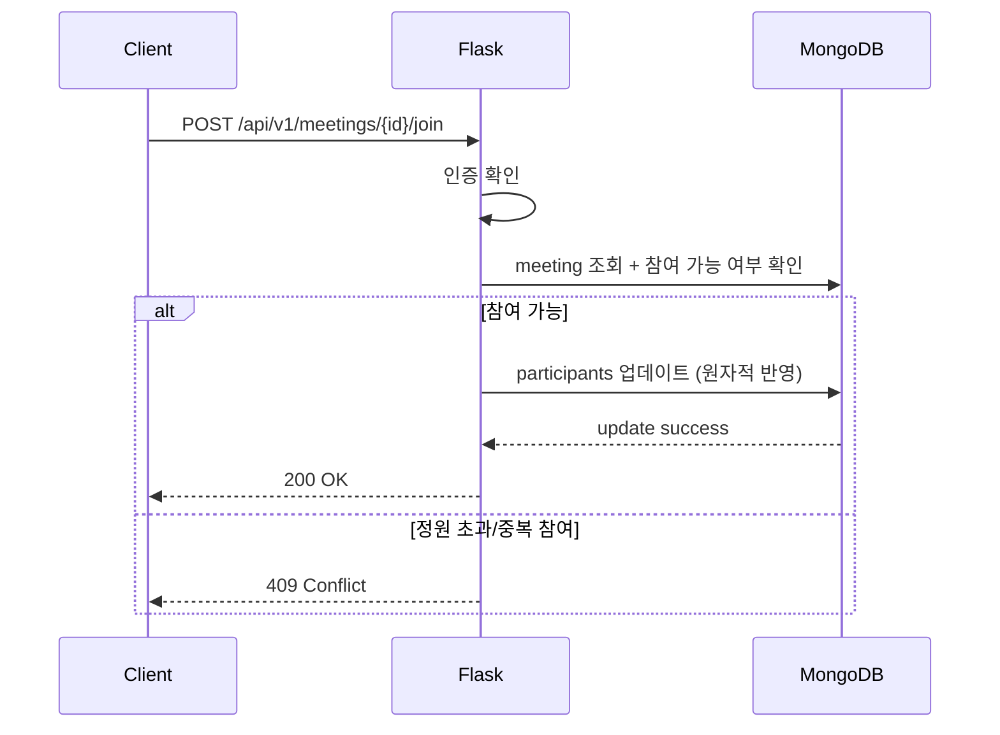

# jungle-soop

`jungle-soop`는 기숙사생이 즉시 모임을 만들고 참여할 수 있도록 설계한 커뮤니티 웹 애플리케이션입니다.

입학시험에서 학습한 기술을 바탕으로 **3박 4일 미니 프로젝트**로 완성하는 것을 목표로 합니다.

---

## 기획 의도 및 기능

### 1) 기획 의도

기숙사 생활에서는 "지금 같이 밥 먹을 사람?", "잠깐 산책 갈 사람?"처럼 **즉시성 있는 소규모 모임 수요**가 자주 발생합니다.  
하지만 기존 커뮤니티는 공지형 게시판 중심이라, 짧은 시간 안에 사람을 모으기 어렵고 참여 흐름도 끊기기 쉽습니다.

`jungle-soop`는 이 문제를 해결하기 위해, 기숙사생이 **빠르게 모임을 생성하고 바로 참여 여부를 확인**할 수 있는 경량 커뮤니티를 목표로 기획했습니다.

- 즉시 개설: 복잡한 절차 없이 모임 생성
- 빠른 탐색: 현재 열려 있는 모임을 한눈에 확인
- 낮은 진입장벽: 익숙한 웹 UI와 간단한 사용자 흐름

---

### 2) 핵심 기능

1. **회원가입/로그인 기능**
  - 사용자 인증을 통해 개인화된 모임 참여 경험 제공
  - 세션 또는 JWT 기반 인증 방식 확장 가능
2. **모임 생성 기능**
  - 모임 제목, 시간, 장소, 인원 등 핵심 정보 등록
  - 짧은 입력만으로 즉시 게시 가능
3. **모임 목록 조회 기능**
  - 현재 모집 중인 모임을 최신순으로 확인
  - 상태(모집중/마감) 기반 필터링 확장 가능
4. **모임 상세/참여 기능**
  - 모임 상세 정보를 확인하고 참여 신청
  - 참여 인원 수를 실시간에 가깝게 반영
5. **모임 관리 기능**
  - 작성자는 본인 모임 수정/삭제 가능
  - 운영 안정성을 위한 기본 권한 제어 적용
6. **반응형 UI 및 사용성 개선**
  - 모바일/데스크톱 환경에서 모두 사용 가능
  - Tailwind 기반의 일관된 화면 구성

## 목차

## 1. Tech Stack

- **프론트엔드**: HTML, CSS, Tailwind, JavaScript, jQuery, AJAX
- **백엔드**: Python, Flask, Jinja2
- **DB**: MongoDB
- **배포/인프라**: AWS, docker, github actions

## 2. 프로젝트 요구사항

### 필수 포함 사항

- 로그인 기능
- Jinja2 템플릿 엔진을 이용한 서버사이드 렌더링

### 더 고민해볼 키워드

- **JWT 인증 방식으로 로그인 구현하기**
  - 쿠키/세션 방식 대비 JWT가 등장한 배경(확장성, 분산 환경, 상태 비저장 인증)을 비교해보기
- **Bootstrap을 대체할 CSS 라이브러리 사용하기**
  - Tailwind CSS, Bulma 등 대안 적용 시 개발 생산성과 유지보수성 비교하기

### 주제 선정 및 진행

- 입학시험 때 배운 기술들을 토대로, 3박 4일간 미니 프로젝트를 완성합니다.
- 유쾌하거나, 의미있거나, 흥미로운 주제를 자유롭게 선정합니다.
- 팀원들과 아이디어 협의 후 제안 발표(수)를 진행합니다.
- 구현 완료 후 결과물 발표(금)를 진행합니다.
- 팀원 한 명의 AWS EC2에 프로젝트를 업로드합니다.
- (옵션) 도메인을 연결해 완성도를 높입니다.

## 3. 시스템 설계

### 전체 아키텍처 다이어그램 uml코드 및 설명




- **Client Layer**: 사용자는 브라우저에서 UI를 조작하고, AJAX 요청으로 모임 관련 데이터를 비동기로 조회/전송합니다.
- **Application Layer**: Flask는 라우팅과 비즈니스 로직을 처리하며, Jinja2를 통해 서버사이드 렌더링(SSR) 화면을 제공합니다.
- **Data Layer**: MongoDB는 사용자, 모임, 참여 정보 등 핵심 도메인 데이터를 저장합니다.
- **Infrastructure/Runtime**: 애플리케이션은 Docker 컨테이너로 패키징되어 AWS EC2 환경에서 실행됩니다.
- **CI/CD**: GitHub Actions가 빌드/배포 파이프라인을 자동화하여 일관된 배포를 지원합니다.

### 💻 프론트엔드 (Client Side)

아래 다이어그램은 사용자 관점에서 핵심 화면 이동 흐름을 단순화한 와이어프레임입니다.




#### 1) 로그인/회원가입 페이지

- **목적**: 사용자 인증 후 서비스 접근 권한 제공
- **핵심 요소**: 이메일(또는 아이디), 비밀번호 입력, 로그인 버튼, 회원가입 링크
- **UX 포인트**: 입력 검증 메시지를 즉시 보여줘 재입력 비용 최소화

와이어프레임 코드 보기 (로그인/회원가입)




#### 2) 모임 목록 페이지 (메인)

- **목적**: 현재 모집 중인 모임을 빠르게 탐색
- **핵심 요소**: 모임 카드 리스트, 모집 상태 뱃지, 생성 버튼, 정렬/필터(확장 가능)
- **UX 포인트**: 카드 단위 정보 요약(제목/시간/장소/현재 인원)으로 탐색 속도 향상

와이어프레임 코드 보기 (모임 목록)




#### 3) 모임 생성 페이지

- **목적**: 최소 입력으로 빠르게 모임 개설
- **핵심 요소**: 제목, 일정, 장소, 최대 인원, 설명, 생성 버튼
- **UX 포인트**: 필수 항목 우선 배치와 간단한 폼 구성으로 작성 부담 완화

와이어프레임 코드 보기 (모임 생성)




#### 4) 모임 상세 페이지

- **목적**: 모임의 전체 정보를 확인하고 참여 의사결정 지원
- **핵심 요소**: 모임 상세 정보, 참여자 수, 참여 버튼, 작성자 전용 수정/삭제 버튼
- **UX 포인트**: 참여 가능 여부(정원/마감 상태)를 버튼 상태로 직관적으로 표현

와이어프레임 코드 보기 (모임 상세)




#### 5) 공통 UI/스타일 가이드

- **스타일 시스템**: Tailwind 기반으로 간격, 색상, 타이포그래피 일관성 유지
- **인터랙션**: jQuery + AJAX로 새로고침 없이 목록/상태 일부 갱신
- **반응형 대응**: 모바일 우선 레이아웃을 기본으로 데스크톱에서 확장

### ⚙️ 백엔드 (Server Side & DB)

백엔드는 `Flask + MongoDB` 구조를 기반으로, 인증/모임/참여 도메인 로직을 REST API와 SSR 라우트로 제공합니다.

#### 1) 로그인 처리 흐름




- **핵심 포인트**: 로그인 성공 시 인증 상태를 세션으로 유지하여 이후 요청에서 사용자 식별을 수행합니다.

#### 2) 모임 생성 흐름




- **핵심 포인트**: 작성자 ID를 모임 데이터에 함께 저장하여 수정/삭제 권한 검증의 기준으로 사용합니다.

#### 3) 모임 목록 조회 흐름




- **핵심 포인트**: 같은 조회 로직을 SSR 페이지와 AJAX(JSON) 응답에서 재사용해 일관된 데이터 표시를 유지합니다.

#### 4) 모임 참여 흐름




- **핵심 포인트**: 정원 초과와 중복 참여를 방지하기 위해 DB 업데이트 시 조건 기반 원자적 처리(atomic update)를 적용합니다.

#### 5) 백엔드 설계 원칙

- **권한 제어**: 작성자 본인만 수정/삭제 가능하도록 서버에서 최종 검증
- **유효성 검증**: 클라이언트 검증과 별개로 서버 측 검증을 필수 적용
- **에러 응답 표준화**: 상태코드 + 메시지 형식 통일로 프론트 처리 단순화
- **확장성 고려**: 인증(세션), 조회 필터, 알림 기능을 단계적으로 확장 가능한 구조 유지

## 4. API 컨벤션

### 1) 목적과 범위

- 이 섹션은 프론트/백엔드 병렬개발 시 인터페이스 충돌을 줄이기 위한 공통 계약입니다.
- 성공 응답은 기능별로 다를 수 있으므로 엔드포인트별 명세를 따릅니다.
- 실패 응답은 프론트 처리 일관성을 위해 공통 포맷을 강제합니다.

---

### 2) 공통 규칙

- **Base Path**: `/api/v1`
- **Content-Type**: `application/json`
- **시간 포맷**: ISO-8601 (`2026-03-04T19:30:00+09:00`)
- **키 네이밍**: `snake_case`
- **리소스 URI**: 복수형 명사 사용 (`/meetings`, `/users`)
- **HTTP Method**
  - `GET`: 조회
  - `POST`: 생성/행위 요청
  - `PATCH`: 부분 수정
  - `DELETE`: 삭제

---

### 3) 인증/인가 규칙

- **인증 방식**: 세션 기반 인증 (HttpOnly Cookie, key: `session`)
- **클라이언트 전송**: `credentials: include`
- **인증 필요 API**: 모임 생성/참여/수정/삭제, 로그아웃
- **인가 규칙**: 모임 수정/삭제는 작성자(`author_id`)만 가능

---

### 4) 공통 실패 응답 포맷

```json
{
  "success": false,
  "error": {
    "code": "INVALID_INPUT",
    "message": "요청 파라미터를 확인해주세요."
  }
}
```

---

### 5) 상태코드 및 에러코드


| HTTP Status                 | 사용 상황                 |
| --------------------------- | --------------------- |
| `200 OK`                    | 조회/수정/참여/취소 성공        |
| `201 Created`               | 리소스 생성 성공             |
| `204 No Content`            | 삭제 성공 (바디 없음)         |
| `400 Bad Request`           | 입력값 검증 실패             |
| `401 Unauthorized`          | 로그인 필요/인증 실패          |
| `403 Forbidden`             | 권한 없음                 |
| `404 Not Found`             | 리소스 없음                |
| `409 Conflict`              | 정원 초과/중복 참여 등 비즈니스 충돌 |
| `500 Internal Server Error` | 서버 내부 예외              |


| Error Code          | HTTP Status | 의미          |
| ------------------- | ----------- | ----------- |
| `INVALID_INPUT`     | `400`       | 요청 필드 검증 실패 |
| `AUTH_REQUIRED`     | `401`       | 로그인 필요      |
| `PERMISSION_DENIED` | `403`       | 작성자 권한 없음   |
| `MEETING_NOT_FOUND` | `404`       | 모임 없음       |
| `MEETING_FULL`      | `409`       | 정원 초과       |
| `ALREADY_JOINED`    | `409`       | 이미 참여한 사용자  |


---

### 6) 엔드포인트 목록 (MVP)


| Method   | Endpoint                             | 인증        | 설명       |
| -------- | ------------------------------------ | --------- | -------- |
| `POST`   | `/api/v1/auth/signup`                | No        | 회원가입     |
| `POST`   | `/api/v1/auth/login`                 | No        | 로그인      |
| `POST`   | `/api/v1/auth/logout`                | Yes       | 로그아웃     |
| `GET`    | `/api/v1/meetings`                   | No        | 모임 목록 조회 |
| `GET`    | `/api/v1/meetings/{meeting_id}`      | No        | 모임 상세 조회 |
| `POST`   | `/api/v1/meetings`                   | Yes       | 모임 생성    |
| `PATCH`  | `/api/v1/meetings/{meeting_id}`      | Yes (작성자) | 모임 수정    |
| `DELETE` | `/api/v1/meetings/{meeting_id}`      | Yes (작성자) | 모임 삭제    |
| `POST`   | `/api/v1/meetings/{meeting_id}/join` | Yes       | 모임 참여    |
| `DELETE` | `/api/v1/meetings/{meeting_id}/join` | Yes       | 모임 참여 취소 |


---

### 7) 엔드포인트별 요청/성공 응답 스펙

#### `POST /api/v1/auth/signup`

- Request Body

```json
{
  "email": "tail1@jungle.soop",
  "password": "password1234",
  "nickname": "tail1"
}
```

- Success (`201`)

```json
{
  "success": true,
  "data": { "user_id": "65e5f2b7b321a8c120f11a01" },
  "message": "회원가입이 완료되었습니다."
}
```

#### `POST /api/v1/auth/login`

- Request Body

```json
{
  "email": "tail1@jungle.soop",
  "password": "password1234"
}
```

- Success (`200`)

```json
{
  "success": true,
  "data": {
    "user_id": "65e5f2b7b321a8c120f11a01",
    "nickname": "tail1"
  },
  "message": "로그인 성공"
}
```

#### `POST /api/v1/auth/logout`

- Request Body

```json
{}
```

- Success (`200`)

```json
{
  "success": true,
  "data": {},
  "message": "로그아웃 완료"
}
```

#### `GET /api/v1/meetings`

- Query
`status=open|closed&sort=latest|deadline&page=1&limit=10`
- Success (`200`)

```json
{
  "success": true,
  "data": {
    "items": [
      {
        "meeting_id": "65e5f4c3b321a8c120f11a55",
        "title": "저녁 같이 먹을 사람",
        "place": "기숙사 정문",
        "scheduled_at": "2026-03-05T18:30:00+09:00",
        "participant_count": 2,
        "max_capacity": 4,
        "status": "open"
      }
    ],
    "pagination": {
      "page": 1,
      "limit": 10,
      "total": 1,
      "total_pages": 1
    }
  },
  "message": "모임 목록 조회 성공"
}
```

#### `GET /api/v1/meetings/{meeting_id}`

- Success (`200`)

```json
{
  "success": true,
  "data": {
    "meeting_id": "65e5f4c3b321a8c120f11a55",
    "title": "저녁 같이 먹을 사람",
    "description": "분식집 가실 분 구해요.",
    "place": "기숙사 정문",
    "scheduled_at": "2026-03-05T18:30:00+09:00",
    "participant_count": 2,
    "max_capacity": 4,
    "status": "open",
    "author_id": "65e5f2b7b321a8c120f11a01"
  },
  "message": "모임 상세 조회 성공"
}
```

#### `POST /api/v1/meetings`

- Request Body

```json
{
  "title": "저녁 같이 먹을 사람",
  "description": "분식집 가실 분 구해요.",
  "place": "기숙사 정문",
  "scheduled_at": "2026-03-05T18:30:00+09:00",
  "max_capacity": 4
}
```

- Success (`201`)

```json
{
  "success": true,
  "data": { "meeting_id": "65e5f4c3b321a8c120f11a55" },
  "message": "모임이 생성되었습니다."
}
```

#### `PATCH /api/v1/meetings/{meeting_id}`

- Request Body (부분 수정)

```json
{
  "title": "저녁 같이 먹을 사람 (시간 변경)",
  "scheduled_at": "2026-03-05T19:00:00+09:00"
}
```

- Success (`200`)

```json
{
  "success": true,
  "data": { "meeting_id": "65e5f4c3b321a8c120f11a55" },
  "message": "모임이 수정되었습니다."
}
```

#### `DELETE /api/v1/meetings/{meeting_id}`

- Success (`204`)
응답 바디 없음

#### `POST /api/v1/meetings/{meeting_id}/join`

- Request Body

```json
{}
```

- Success (`200`)

```json
{
  "success": true,
  "data": {
    "meeting_id": "65e5f4c3b321a8c120f11a55",
    "participant_count": 3,
    "status": "open"
  },
  "message": "모임 참여가 완료되었습니다."
}
```

#### `DELETE /api/v1/meetings/{meeting_id}/join`

- Success (`200`)

```json
{
  "success": true,
  "data": {
    "meeting_id": "65e5f4c3b321a8c120f11a55",
    "participant_count": 2,
    "status": "open"
  },
  "message": "모임 참여가 취소되었습니다."
}
```

---

### 8) 병렬개발 운영 규칙

- API 변경 시 PR 본문에 변경점과 영향 범위를 반드시 작성합니다.
- API 변경 시 같은 PR에서 `README.md`의 API 섹션을 같이 수정합니다.
- breaking change(필드명 변경/삭제, 응답 구조 변경)는 합의 후 반영합니다.
- 프론트 Mock 데이터도 본 문서 스키마와 동일하게 유지합니다.

## 5. Database Schema (데이터베이스 스키마)

MongoDB 기준으로 `users`, `meetings` 2개 컬렉션을 운영합니다.

### 1) 설계 원칙

- 참조 중심(정규화) 설계로 중복 데이터와 갱신 비용을 최소화합니다.
- API 응답에 필요한 값만 저장하고, 파생값(`participant_count`)은 서버 로직으로 보장합니다.
- 스키마 변경 시 API 명세와 함께 같은 PR에서 동기화합니다.

---

### 2) 컬렉션 요약


| Collection | 목적             | 주요 참조                                                   |
| ---------- | -------------- | ------------------------------------------------------- |
| `users`    | 계정/인증 정보 관리    | -                                                       |
| `meetings` | 모임 생성/조회/참여 관리 | `author_id -> users._id`, `participants[] -> users._id` |


---

### 3) `users` 스키마


| Field           | Type     | Required | Rules / Notes                |
| --------------- | -------- | -------- | ---------------------------- |
| `_id`           | ObjectId | Yes      | MongoDB 기본 PK                |
| `email`         | String   | Yes      | lowercase 저장, unique         |
| `password_hash` | String   | Yes      | 원문 비밀번호 저장 금지                |
| `nickname`      | String   | Yes      | 화면 표시 이름                     |
| `role`          | String   | No       | 기본값 `user` (`user`, `admin`) |
| `created_at`    | Date     | Yes      | 생성 시각                        |
| `updated_at`    | Date     | Yes      | 수정 시각                        |


#### 인덱스 (`users`)

- `{ email: 1 }` unique
- `{ created_at: -1 }`

#### Example Document (`users`)

```json
{
  "_id": { "$oid": "65e5f2b7b321a8c120f11a01" },
  "email": "tail1@jungle.soop",
  "password_hash": "$2b$12$examplehashedpasswordvalue",
  "nickname": "tail1",
  "role": "user",
  "created_at": { "$date": "2026-03-04T10:00:00Z" },
  "updated_at": { "$date": "2026-03-04T10:00:00Z" }
}
```

---

### 4) `meetings` 스키마


| Field          | Type     | Required | Rules / Notes     |
| -------------- | -------- | -------- | ----------------- |
| `_id`          | ObjectId | Yes      | MongoDB 기본 PK     |
| `title`        | String   | Yes      | 1~100자 권장         |
| `description`  | String   | No       | 상세 설명             |
| `place`        | String   | Yes      | 모임 장소             |
| `scheduled_at` | Date     | Yes      | 모임 시작 시각          |
| `max_capacity` | Int      | Yes      | 최소 2 이상           |
| `author_id`    | ObjectId | Yes      | 작성자 (`users._id`) |
| `participants` | Array    | Yes      | 참여자 ID 목록         |
| `status`       | String   | Yes      | `open` / `closed` |
| `created_at`   | Date     | Yes      | 생성 시각             |
| `updated_at`   | Date     | Yes      | 수정 시각             |


#### 인덱스 (`meetings`)

- `{ status: 1, scheduled_at: 1 }`
- `{ created_at: -1 }`
- `{ author_id: 1, created_at: -1 }`

#### Example Document (`meetings`)

```json
{
  "_id": { "$oid": "65e5f4c3b321a8c120f11a55" },
  "title": "저녁 같이 먹을 사람",
  "description": "기숙사 앞 분식집 가실 분 구해요.",
  "place": "기숙사 정문",
  "scheduled_at": { "$date": "2026-03-04T18:30:00Z" },
  "max_capacity": 4,
  "author_id": { "$oid": "65e5f2b7b321a8c120f11a01" },
  "participants": [
    { "$oid": "65e5f2b7b321a8c120f11a01" },
    { "$oid": "65e5f31ab321a8c120f11a15" }
  ],
  "status": "open",
  "created_at": { "$date": "2026-03-04T09:30:00Z" },
  "updated_at": { "$date": "2026-03-04T09:40:00Z" }
}
```

---

### 5) 정합성 규칙 (서버 로직 강제)

- 참여 가능: `participants.length < max_capacity`
- 중복 참여 금지: `$addToSet` 기반으로 동일 `user_id` 삽입 차단
- 작성자 권한: `author_id == current_user_id`인 경우만 수정/삭제 허용
- 상태 동기화: 정원 도달 시 `status=closed`, 취소 후 여유 발생 시 `status=open`

---

### 6) 관계 요약

- `users (1) -> (N) meetings` (작성 관계)
- `users (N) <-> (N) meetings` (`participants` 기반 참여 관계)

## 6. Directory Structure (디렉토리 구조)

현재 기술 스택(Flask + Jinja2 + MongoDB + Docker + GitHub Actions)을 기준으로, 아래 구조를 기본으로 사용합니다.

```text
jungle-soop/
├─ app/                          # Flask 애플리케이션 루트
│  ├─ __init__.py                # create_app(), extension 초기화
│  ├─ config.py                  # 환경별 설정 클래스
│  ├─ extensions.py              # db/session 등 확장 객체
│  ├─ models/                    # MongoDB 모델/리포지토리 레이어
│  │  ├─ user_repository.py
│  │  └─ meeting_repository.py
│  ├─ services/                  # 비즈니스 로직
│  │  ├─ auth_service.py
│  │  └─ meeting_service.py
│  ├─ routes/                    # Flask 블루프린트/라우트
│  │  ├─ pages.py                # SSR 페이지 라우트
│  │  ├─ auth_api.py             # /api/v1/auth
│  │  └─ meetings_api.py         # /api/v1/meetings
│  ├─ templates/                 # Jinja2 템플릿
│  │  ├─ layouts/
│  │  ├─ auth/
│  │  └─ meetings/
│  └─ static/
│     ├─ css/
│     ├─ js/
│     └─ images/
├─ tests/
│  ├─ unit/                      # 서비스/유틸 단위 테스트
│  ├─ integration/               # API + DB 통합 테스트
│  └─ e2e/                       # (선택) 핵심 사용자 시나리오
├─ scripts/
│  ├─ seed.py                    # 로컬 개발용 샘플 데이터
│  └─ wait_for_mongo.py          # 컨테이너 기동 대기 스크립트
├─ docker/
│  ├─ Dockerfile                 # 앱 이미지 빌드
│  ├─ docker-compose.yml         # 운영/기본: app + mongo
│  ├─ docker-compose.dev.yml     # 개발 전용: mongo-express 추가
│  └─ docker-compose.test.yml    # 테스트 전용 compose
├─ .env.example
├─ run.py                        # 로컬 실행 엔트리포인트
├─ requirements.txt
├─ requirements-dev.txt
└─ README.md
```

### 구조 설계 기준

- `routes`는 요청/응답만 담당하고, 핵심 규칙은 `services`로 분리합니다.
- DB 접근은 `models(repository)`를 통해 일관되게 관리합니다.
- SSR(`pages.py`)과 API(`*_api.py`)를 분리해 변경 영향도를 줄입니다.
- Docker 관련 파일은 `docker/`에 모아 로컬 파일과 책임을 분리합니다.
- `mongo-express`는 `docker/docker-compose.dev.yml`에서만 활성화합니다 (운영 기본 비활성화).

## 7. Prerequisites (사전 요구사항)

### 필수 설치

- Python `3.11+`
- Docker Desktop (Docker Engine + Compose 포함)
- Git

### 의존성 설치

개발 시작 시 아래 스크립트 **한 번 실행**으로 가상환경 생성 + 의존성 설치 + `.env` 생성까지 자동으로 진행됩니다.

Windows PowerShell:

```powershell
.\scripts\bootstrap.ps1
```

macOS / Linux:

```bash
bash ./scripts/bootstrap.sh
```

bootstrap 스크립트는 기본으로 `requirements-dev.txt`를 설치합니다.
수동 설치가 필요한 경우에도 아래 명령을 권장합니다.

```bash
pip install -r requirements-dev.txt
```

### 환경 변수 (선택)

기본 개발 환경은 코드 기본값으로 동작하도록 구성하고, 필요한 경우에만 `.env`를 사용합니다.

- 권장 방식: `.env.example`를 복사해서 `.env` 생성
- 민감 정보(`SECRET_KEY` 등)는 로컬마다 별도 설정

## 8. How to Run (실행 방법)

### 1) 로컬 실행

사전 준비가 안 되어 있다면 먼저 bootstrap 스크립트를 실행합니다.

```powershell
.\scripts\bootstrap.ps1
```

현재 저장소는 **초기 세팅 단계**이므로 아래 실행 파일이 아직 준비되지 않았을 수 있습니다.
아래 실행 명령은 `feature/setup-flask-app` 완료 후 사용합니다.

```bash
python -m venv .venv
source .venv/bin/activate
python run.py
```

Windows PowerShell 예시:

```powershell
python -m venv .venv
.\.venv\Scripts\Activate.ps1
python run.py
```

### 2) Docker 실행 (기본: app + mongo)

`docker/docker-compose.yml` 작성 완료(`feature/setup-docker-compose`) 후 사용합니다.

```bash
docker compose -f docker/docker-compose.yml up -d --build
```

### 3) Docker 개발 실행 (mongo-express 포함)

`docker/docker-compose.dev.yml` 작성 완료 후 사용합니다.

```bash
docker compose -f docker/docker-compose.yml -f docker/docker-compose.dev.yml up -d --build
```

### 4) 종료

```bash
docker compose -f docker/docker-compose.yml down
```

## 9. 테스트 (Testing)

### 테스트 전략 (권장)

로컬 테스트와 Docker 테스트를 **둘 다 운영하는 방식**을 권장합니다.

- **로컬 테스트**: 개발 중 빠른 피드백 용도 (가장 자주 실행)
- **Docker 테스트**: 배포 환경과 유사한 조건 검증 용도 (PR/머지 전 필수)

### 왜 둘 다 필요한가?

- 로컬은 실행 속도가 빠르고 디버깅이 쉽습니다.
- Docker는 실제 런타임 환경(의존성/네트워크/환경변수) 차이를 줄여줍니다.
- 둘 중 하나만 쓰면 "내 로컬에서는 되는데 배포에서 깨지는" 경우가 늘어납니다.

### 최소 운영 기준

- 개발자: 기능 작업 중 `unit` + 필요한 `integration` 로컬 실행
- PR 전: `docker/docker-compose.test.yml` 기반 통합 테스트 1회 실행
- CI: PR/push 시 Docker 기반 테스트 실행
- CD: `main` 브랜치 머지(또는 push) 시 단일 EC2 서버 자동 배포

### 테스트 실행 방법

> 아래 명령은 `feature/setup-flask-app`, `feature/test-unit-integration`,  
> `feature/setup-docker-compose` 완료 후 사용합니다.

#### 1) 로컬 테스트 실행

PowerShell:

```powershell
.\scripts\bootstrap.ps1
.\.venv\Scripts\Activate.ps1
python -m pytest -q
```

macOS / Linux:

```bash
bash ./scripts/bootstrap.sh
source .venv/bin/activate
python -m pytest -q
```

#### 2) 특정 테스트만 실행

```bash
python -m pytest tests/unit -q
python -m pytest tests/integration -q
```

#### 3) 커버리지 포함 실행

```bash
python -m pytest --cov=app --cov-report=term-missing
```

#### 4) Docker 테스트 실행

```bash
docker compose -f docker/docker-compose.test.yml up --build --abort-on-container-exit
docker compose -f docker/docker-compose.test.yml down -v
```

### Compose 파일 운영 원칙

- `docker/docker-compose.yml`: 기본/운영 용도 (`app + mongo`)
- `docker/docker-compose.dev.yml`: 개발 보조 용도 (`mongo-express` 포함)
- `docker/docker-compose.test.yml`: 테스트 전용 격리 환경

## 10. Development Guide & Progress

### 📌 Commit Message Convention

커밋 메시지는 아래 형식을 따릅니다.

`<type>: <subject>`

예시:

- `feat: add meeting creation endpoint`
- `fix: prevent duplicate meeting join`
- `refactor: split meeting service and repository`
- `docs: update API and schema guide`

`type` 규칙:

- `feat`: 기능 추가
- `fix`: 버그 수정
- `refactor`: 구조 개선(동작 변화 없음)
- `test`: 테스트 추가/수정
- `docs`: 문서 변경
- `chore`: 설정/빌드/의존성 작업

권장 규칙:

- 한 커밋에는 하나의 목적만 담기
- 제목은 50자 내외의 명령형 문장
- 큰 변경은 PR 설명에서 배경과 의도를 보강

### ✅ Roadmap & Progress

초기 세팅 브랜치(`setup-*`, `test-*`, `ci-*`)를 먼저 완료한 뒤,
기능 브랜치에서 구현 + 테스트를 동시에 진행합니다.
배포 환경은 미니 프로젝트 특성상 **단일 EC2 서버 1대**를 사용합니다.

#### 🌱 Branch: `main`
- [x] Initial commit: 프로젝트 문서/기준 정리
  - [x] 기획 의도/핵심 기능 정의
  - [x] 시스템 아키텍처/프론트 와이어프레임 정리
  - [x] API 컨벤션 및 엔드포인트 스펙 정리
  - [x] Database Schema 및 정합성 규칙 정리
  - [x] 기본 디렉토리 구조/테스트 전략 문서화
  - [x] bootstrap 스크립트 및 `.env.example` 작성

#### 🌿 Branch: `feature/setup-flask-app` (Flask 기본 앱 구성)
- [x] feat: `run.py` 엔트리포인트 작성
- [x] feat: `app/__init__.py` + `create_app()` 구조 작성
- [x] feat: 헬스체크/기본 라우트 작성
- [x] test: 앱 부팅 및 기본 라우트 테스트 작성

#### 🌿 Branch: `feature/setup-docker-compose` (Docker 환경 구성)
- [ ] feat: `docker/docker-compose.yml` 작성 (app + mongo)
- [ ] feat: `docker/docker-compose.dev.yml` 작성 (mongo-express 포함)
- [ ] feat: `docker/docker-compose.test.yml` 작성 (테스트 전용)
- [ ] test: 로컬/도커 실행 시나리오 검증

#### ⚙️ Branch: `feature/test-unit-integration` (테스트 체계 / 초기 세팅 우선)
- [ ] test: 서비스 단위 테스트 기본 골격 작성
- [ ] test: API + DB 통합 테스트 기본 골격 작성
- [ ] test: `docker/docker-compose.test.yml` 기준 테스트 통과
- [ ] rule: 기능 브랜치에서 테스트 동시 작성 규칙 반영

#### ⚙️ Branch: `feature/ci-github-actions` (CI / 초기 세팅 우선)
- [ ] feat: GitHub Actions CI workflow 작성
- [ ] feat: PR/push 시 자동 테스트 실행
- [ ] feat: `main` 머지 시 EC2 자동 배포 workflow 작성
- [ ] docs: CI 파이프라인 문서 반영

#### 🌿 Branch: `feature/auth-signup` (회원가입)
- [ ] feat: 백엔드 - `POST /api/v1/auth/signup` 구현
- [ ] feat: 입력값 검증/중복 이메일 검증
- [ ] test: 회원가입 성공/실패 케이스 테스트

#### 🌿 Branch: `feature/auth-login-logout` (로그인/로그아웃)
- [ ] feat: 백엔드 - `POST /api/v1/auth/login` 구현
- [ ] feat: 백엔드 - `POST /api/v1/auth/logout` 구현
- [ ] feat: 세션 생성/삭제 처리
- [ ] test: 로그인/로그아웃 테스트

#### 🌿 Branch: `feature/auth-guard` (인증/인가)
- [ ] feat: 인증 미들웨어 구현 (세션 기반)
- [ ] feat: 작성자 권한 검증 로직 구현
- [ ] fix: 인증/인가 실패 공통 에러 응답 적용
- [ ] test: 401/403 케이스 테스트

#### 🌿 Branch: `feature/meetings-crud` (모임 CRUD)
- [ ] feat: 백엔드 - `POST /api/v1/meetings` 구현
- [ ] feat: 백엔드 - `PATCH /api/v1/meetings/{meeting_id}` 구현
- [ ] feat: 백엔드 - `DELETE /api/v1/meetings/{meeting_id}` 구현
- [ ] test: 모임 CRUD API 테스트

#### 🌿 Branch: `feature/meetings-query` (모임 조회)
- [ ] feat: 백엔드 - `GET /api/v1/meetings` 구현 (필터/정렬/페이지네이션)
- [ ] feat: 백엔드 - `GET /api/v1/meetings/{meeting_id}` 구현
- [ ] test: 목록/상세 조회 테스트

#### 🌿 Branch: `feature/meetings-join` (모임 참여/취소)
- [ ] feat: 백엔드 - `POST /api/v1/meetings/{meeting_id}/join` 구현
- [ ] feat: 백엔드 - `DELETE /api/v1/meetings/{meeting_id}/join` 구현
- [ ] fix: 중복 참여/정원 초과 방지 로직 적용
- [ ] test: 참여/취소/충돌(409) 테스트

#### 🎨 Branch: `feature/ui-auth-pages` (인증 화면 연동)
- [ ] feat: 로그인/회원가입 페이지 작성
- [ ] feat: 폼 검증/오류 메시지 처리
- [ ] test: 인증 플로우 수동 테스트

#### 🎨 Branch: `feature/ui-meeting-pages` (모임 화면 연동)
- [ ] feat: 목록/상세/생성 화면 구현
- [ ] feat: API 연동 및 상태 반영
- [ ] test: 화면별 주요 시나리오 점검

#### 🎨 Branch: `feature/ui-ajax-interaction` (AJAX 상호작용)
- [ ] feat: 새로고침 없는 목록 갱신 처리
- [ ] feat: 참여/취소 후 UI 즉시 반영
- [ ] test: 비동기 동작 검증

#### ⚙️ Branch: `feature/deploy-ec2` (배포)
- [ ] feat: 단일 EC2 서버 배포 스크립트/절차 작성
- [ ] feat: Docker 기반 배포 검증
- [ ] docs: 배포/운영 체크리스트 문서화

#### 📝 Merge to `main`
- [ ] 기능 브랜치 병합 완료
- [ ] 통합 테스트 완료
- [ ] Docker 실행/배포 검증 완료
- [ ] README 최종 동기화 완료

### 테스트 원칙 (Shift-left)

- 테스트는 Phase 마지막에 모아서 하지 않고 **기능 개발과 동시에** 작성합니다.
- 각 기능 브랜치에서 최소 1개 이상의 단위/통합 테스트를 함께 추가합니다.
- PR 머지 조건:
  - [ ] 로컬 테스트 통과
  - [ ] `docker/docker-compose.test.yml` 기준 테스트 통과
  - [ ] 수동 핵심 시나리오 점검 완료

### 🐣 Git/GitHub 사용 가이드 (초보자용)

처음 한 번만:

```bash
git clone <repository-url>
cd jungle-soop
```

작업 시작:

```bash
git checkout main
git pull origin main
git checkout -b feature/<branch-name>
```

코드 수정 후 커밋:

```bash
git add .
git commit -m "feat: 기능 설명"
```

원격에 푸시:

```bash
git push origin feature/<branch-name>
```

작업 중 최신 코드 반영:

```bash
git checkout main
git pull origin main
git checkout feature/<branch-name>
git merge main
```

작업 끝난 후:
- GitHub에서 `Compare & pull request` 클릭
- PR 템플릿 작성 후 리뷰 요청 (`base: main`)
- 머지 완료되면 로컬 정리:

```bash
git checkout main
git pull origin main
git branch -d feature/<branch-name>
```

자주 하는 실수 체크:
- `main`에서 직접 작업하지 않기
- 커밋 전에 `git status`로 변경 파일 확인하기
- 에러가 나면 메시지 복사해서 팀원/리뷰어에게 공유하기

### 📝 Pull Request 가이드

PR 생성 시 다음 절차를 따릅니다:

1. **브랜치 푸시**

   실행:

   ```bash
   git push origin <branch-name>
   ```

2. **PR 생성**
   - GitHub 저장소에서 `Compare & pull request` 버튼 클릭
   - 또는 직접 PR 생성 페이지로 이동:  
     `https://github.com/<owner>/<repo>/pull/new/<branch-name>`
   - 저장소 생성 후 위 URL의 `<owner>/<repo>`를 실제 값으로 교체합니다.

3. **PR 템플릿 사용**
   - PR 생성 시 `.github/pull_request_template.md` 템플릿이 자동으로 표시됩니다.
   - 각 섹션을 작성하여 변경 목적/영향 범위를 명확히 설명합니다.

4. **PR 제목 규칙**
   - 커밋 메시지 컨벤션과 동일하게 작성
   - 예: `feat: 모임 CRUD 기능 구현`, `fix: MongoDB 연결 오류 수정`

5. **리뷰 및 머지**
   - 코드 리뷰 완료 후 머지
   - 머지 후 로컬에서 `main` 브랜치 업데이트:

   ```bash
   git checkout main
   git pull origin main
   ```

**PR 템플릿 위치:** `.github/pull_request_template.md`

## 🔍 Troubleshooting & Challenges

